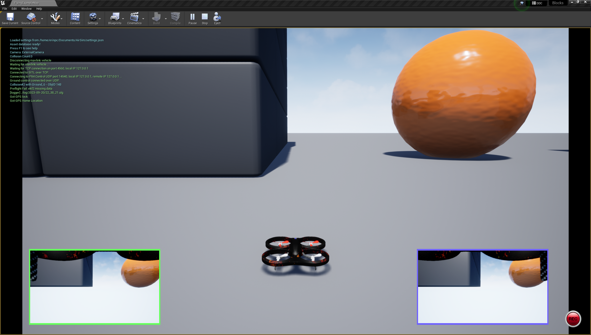
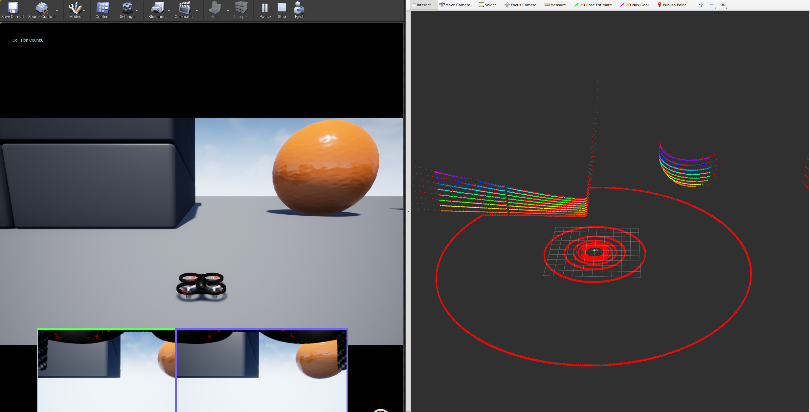
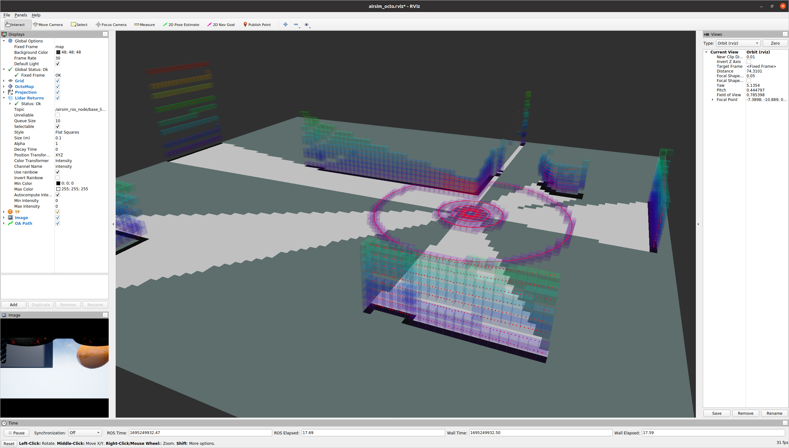

# airsim vehicle

This is an alternative AirSim/Unreal wrapper based off the [Microsoft version](https://github.com/microsoft/AirSim), but updated to work better with MAVROS and remove unneeded extras. It is in active development so please be patient and report any newly discovered bugs as issues.

## Dependencies- Unreal/AirSim

This wrapper requires Unreal and AirSim to be installed first, and has been tested on Ubuntu 20.04 with ROS Noetic. AirSim provides good [instructions](https://microsoft.github.io/AirSim/build_linux/) for setting up both Unreal and AirSim on Linux.

## Setup

Create a workspace, clone the required repos, and build:
```
mkdir -p airsim_ros/src
cd airsim_ros/src
git clone https://github.com/robotics88official/airsim-mavros-wrapper.git
git clone https://github.com/robotics88official/octomap-slice.git
git clone https://github.com/robotics88official/range-data-to-mavros.git
git clone https://github.com/robotics88official/dyn_small_obs_avoidance.git
git clone https://github.com/fyandun/rs_to_velodyne.git
cd ..
rosdep install --from-paths src --ignore-src -r -y
catkin build
```

Then copy the AirSim settings file corresponding to the desired flight controller into Documents:

`cp src/airsim-mavros-wrapper/config/<fc_type>_settings.json ~/Documents/AirSim/settings.json`

This will be the default settings launched in Unreal.

## Usage 

Start Unreal, then the flight control (ArduCopter or PX4), then press Play in Unreal. You should see this screen.



The new default settings will start SLAM and no octomap. In that case, Unreal and Rviz should look like this.



### flight controller

To launch ArduPilot, follow SITL setup [instructions](https://ardupilot.org/dev/docs/setting-up-sitl-on-linux.html), then:

```
cd <path_to>/ardupilot/ArduCopter
../Tools/autotest/sim_vehicle.py --mavproxy-args="--streamrate=-1" -v ArduCopter -f airsim-copter --add-param-file=../libraries/SITL/examples/Airsim/lidar.parm --console
```

To launch PX4, follow SITL setup [instructions](https://microsoft.github.io/AirSim/px4_sitl/), then:

```
cd <path_to>/PX4_Autopilot
make px4_sitl_default none_iris
```

ArduPilot is the default and has been tested with this wrapper much more thoroughly, but both work.

### airsim wrapper

Don't start this too quickly after starting the flight controller and Unreal. MAVROS seems to have issues connecting. 30 seconds or so is usually enough.

`roslaunch airsim_launch airsim_main.launch`

To use PX4, add the arg `ardupilot:=false`. 

The camera ROS publishers are disabled by default as it slows the publishing rate for everything to ~3Hz. To run with camera publishers on, add the arg `enable_cameras:=true`. When running with cameras enabled and do_octomap set to true, Rviz looks like this.



### manual flight

To test how the map looks as the vehicle moves around, you can fly the ArduPilot drone with terminal commands. In the ArduPilot terminal, run:

```
mode guided
arm throttle
takeoff 2
module load message
```
Then you can use any of the following commands.

* message SET_POSITION_TARGET_LOCAL_NED 0 0 0 9 3576 20 0 0 0 0 0 0 0 0 0 0
    * Flies 20m forward (necessary in Blocks to see an obstacle)
* message SET_POSITION_TARGET_LOCAL_NED 0 0 0 9 3576 0 0 -2 0 0 0 0 0 0 0 0
    * Flies up 5m
* message SET_POSITION_TARGET_LOCAL_NED 0 0 0 9 2503 0 0 0 0 0 0 0 0 0 1.5707963 0
    * Rotates 90 deg to right
* message SET_POSITION_TARGET_OFFSET_NED 0 0 0 9 3527 0 0 0 2 0 0 0 0 0 0 0
    * Forward velocity at 2 m/s for 3 seconds (built-in velocity command stops after 3 sec)


## notes

This wrapper removed a lot of the abstractions of the original Microsoft ROS wrapper in favor of efficiency. The result is a wrapper that runs faster, but only for a single MultiRotor, and only when using one of the two main industry standard flight controllers (PX4 or ArduPilot). We also corrected some issues with left/right frames being flipped, static transforms published as dynamic and vice versa, and reverted to standard UAS frame conventions where needed for base_link/base_link_frd, map/map_ned, and odom/odom_ned.

### IMU

The best results with respect to IMU seem to come from the mavros topic (`/mavros/imu/data`) rather than the airsim internal IMU topic. To adjust the frequency of MAVROS publishing, change the line in the launch file to:

`<node pkg="rosservice" type="rosservice" name="rosservice" args="call --wait /mavros/set_stream_rate 0 [your_desired_hz] 1"/>`

### Frame Conventions

Following MAVROS conventions, any frame that does not have _ned/_frd appended is ENU/FLU.